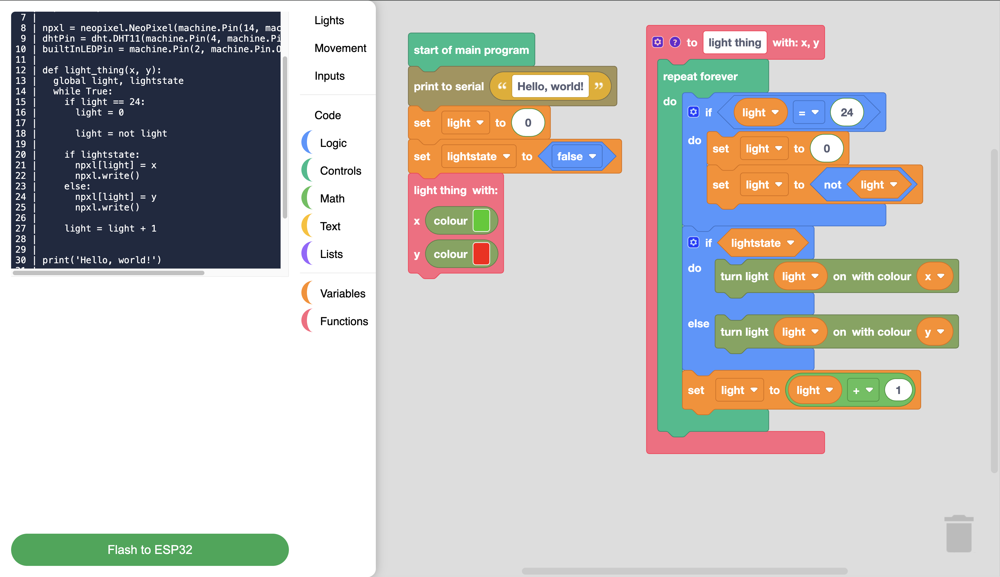

# R32-D32 droid blockly code editor

it's a(n) instance/fork/thing of [google's (now RaspberryPiFoundation's) blockly](https://github.com/RaspberryPiFoundation/blockly) specialised for Tinkertanker's ESP32 Droid kit.

hosted @ [https://altaf-creator.github.io/droid-esp32-blockly/](https://altaf-creator.github.io/droid-esp32-blockly/)

## Getting Started
the [wiki](https://github.com/altaf-creator/droid-esp32-blockly/wiki) will provide you all the necessary information (should be)
